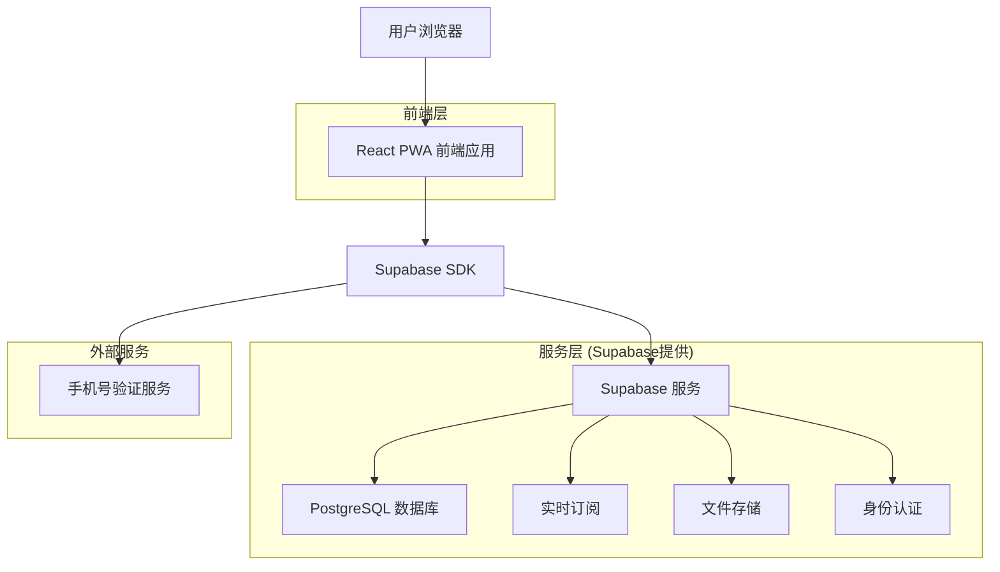
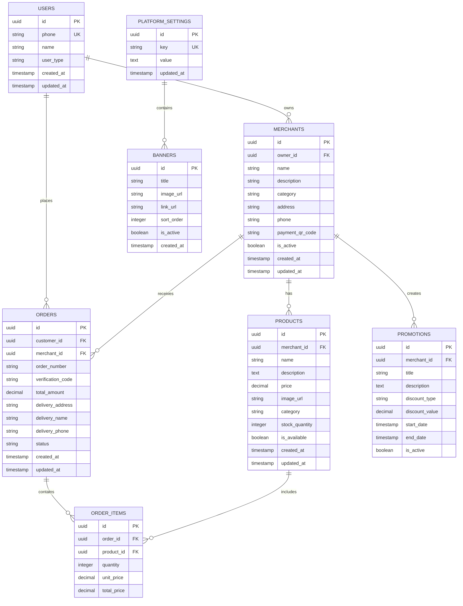

# 码上购 - 技术架构文档

## 1. Architecture design



## 2. Technology Description

* **前端**: React\@18 + TypeScript + Tailwind CSS\@3 + Vite + PWA

* **后端**: Supabase (PostgreSQL + 实时订阅 + 身份认证 + 文件存储)

* **状态管理**: React Context + useState/useReducer

* **UI组件**: 自定义组件库 + Headless UI

* **图标**: Heroicons + 自定义医疗主题图标

* **PWA**: Workbox + Service Worker

* **手机验证**: Supabase Auth + 第三方短信服务

## 3. Route definitions

| Route                      | Purpose           |
| -------------------------- | ----------------- |
| /                          | 顾客端首页，展示轮播图和商家列表  |
| /auth/login                | 登录页面，支持手机号密码登录    |
| /auth/register             | 注册页面，手机号验证码注册流程   |
| /merchant/:id              | 商家详情页，展示商品列表和商家信息 |
| /cart                      | 购物车页面，商品清单和结算功能   |
| /checkout                  | 订单支付页，收货信息和支付流程   |
| /orders                    | 订单列表页，查看历史订单      |
| /orders/:id                | 订单详情页，实时跟踪订单状态    |
| /profile                   | 用户个人中心，账户信息管理     |
| /merchant-admin            | 商家管理后台首页          |
| /merchant-admin/menu       | 菜单管理页面            |
| /merchant-admin/orders     | 商家订单处理页面          |
| /merchant-admin/payment    | 收款码管理页面           |
| /merchant-admin/promotions | 优惠活动管理页面          |
| /merchant-admin/profile    | 店铺信息管理页面          |
| /super-admin               | 超级管理员后台首页         |
| /super-admin/users         | 用户账户管理页面          |
| /super-admin/merchants     | 商家账户管理页面          |
| /super-admin/content       | 平台内容管理页面          |
| /super-admin/analytics     | 数据统计分析页面          |

## 4. API definitions

### 4.1 Core API

**用户认证相关**

```typescript
// 手机号注册
supabase.auth.signUp({
  phone: '+86' + phoneNumber,
  password: password,
  options: {
    data: {
      name: userName,
      user_type: 'customer' | 'merchant'
    }
  }
})

// 手机号登录
supabase.auth.signInWithPassword({
  phone: '+86' + phoneNumber,
  password: password
})

// 发送验证码（仅用于密码重置）
supabase.auth.resetPasswordForPhone({
  phone: '+86' + phoneNumber
})
```

**商家相关API**

```typescript
// 获取商家列表
GET /rest/v1/merchants?select=*,merchant_categories(*)

// 获取商家详情
GET /rest/v1/merchants?id=eq.{merchant_id}&select=*,products(*)

// 更新商家信息
PATCH /rest/v1/merchants?id=eq.{merchant_id}
```

**商品相关API**

```typescript
// 获取商品列表
GET /rest/v1/products?merchant_id=eq.{merchant_id}&is_available=eq.true

// 创建商品
POST /rest/v1/products

// 更新商品
PATCH /rest/v1/products?id=eq.{product_id}
```

**订单相关API**

```typescript
// 创建订单
POST /rest/v1/orders

// 获取订单列表
GET /rest/v1/orders?customer_id=eq.{user_id}&select=*,order_items(*,products(*))

// 更新订单状态
PATCH /rest/v1/orders?id=eq.{order_id}

// 实时订阅订单状态
supabase
  .channel('orders')
  .on('postgres_changes', {
    event: 'UPDATE',
    schema: 'public',
    table: 'orders',
    filter: `customer_id=eq.${userId}`
  }, handleOrderUpdate)
  .subscribe()
```

## 5. Data model

### 5.1 Data model definition



### 5.2 Data Definition Language

**用户表 (users)**

```sql
-- 扩展用户配置表
CREATE TABLE user_profiles (
    id UUID PRIMARY KEY REFERENCES auth.users(id) ON DELETE CASCADE,
    phone VARCHAR(20) UNIQUE NOT NULL,
    name VARCHAR(100) NOT NULL,
    user_type VARCHAR(20) DEFAULT 'customer' CHECK (user_type IN ('customer', 'merchant', 'super_admin')),
    created_at TIMESTAMP WITH TIME ZONE DEFAULT NOW(),
    updated_at TIMESTAMP WITH TIME ZONE DEFAULT NOW()
);

-- 创建索引
CREATE INDEX idx_user_profiles_phone ON user_profiles(phone);
CREATE INDEX idx_user_profiles_user_type ON user_profiles(user_type);
```

**商家表 (merchants)**

```sql
CREATE TABLE merchants (
    id UUID PRIMARY KEY DEFAULT gen_random_uuid(),
    owner_id UUID REFERENCES user_profiles(id) ON DELETE CASCADE,
    name VARCHAR(200) NOT NULL,
    description TEXT,
    category VARCHAR(100) NOT NULL,
    address TEXT NOT NULL,
    phone VARCHAR(20) NOT NULL,
    payment_qr_code TEXT,
    is_active BOOLEAN DEFAULT true,
    created_at TIMESTAMP WITH TIME ZONE DEFAULT NOW(),
    updated_at TIMESTAMP WITH TIME ZONE DEFAULT NOW()
);

CREATE INDEX idx_merchants_owner_id ON merchants(owner_id);
CREATE INDEX idx_merchants_category ON merchants(category);
CREATE INDEX idx_merchants_is_active ON merchants(is_active);
```

**商品表 (products)**

```sql
CREATE TABLE products (
    id UUID PRIMARY KEY DEFAULT gen_random_uuid(),
    merchant_id UUID REFERENCES merchants(id) ON DELETE CASCADE,
    name VARCHAR(200) NOT NULL,
    description TEXT,
    price DECIMAL(10,2) NOT NULL CHECK (price >= 0),
    image_url TEXT,
    category VARCHAR(100),
    stock_quantity INTEGER DEFAULT 0 CHECK (stock_quantity >= 0),
    is_available BOOLEAN DEFAULT true,
    created_at TIMESTAMP WITH TIME ZONE DEFAULT NOW(),
    updated_at TIMESTAMP WITH TIME ZONE DEFAULT NOW()
);

CREATE INDEX idx_products_merchant_id ON products(merchant_id);
CREATE INDEX idx_products_category ON products(category);
CREATE INDEX idx_products_is_available ON products(is_available);
```

**订单表 (orders)**

```sql
CREATE TABLE orders (
    id UUID PRIMARY KEY DEFAULT gen_random_uuid(),
    customer_id UUID REFERENCES user_profiles(id) ON DELETE CASCADE,
    merchant_id UUID REFERENCES merchants(id) ON DELETE CASCADE,
    order_number VARCHAR(50) UNIQUE NOT NULL,
    verification_code VARCHAR(10) NOT NULL,
    total_amount DECIMAL(10,2) NOT NULL CHECK (total_amount >= 0),
    delivery_address TEXT NOT NULL,
    delivery_name VARCHAR(100) NOT NULL,
    delivery_phone VARCHAR(20) NOT NULL,
    status VARCHAR(50) DEFAULT 'pending' CHECK (status IN ('pending', 'paid', 'confirmed', 'preparing', 'delivering', 'completed', 'cancelled')),
    created_at TIMESTAMP WITH TIME ZONE DEFAULT NOW(),
    updated_at TIMESTAMP WITH TIME ZONE DEFAULT NOW()
);

CREATE INDEX idx_orders_customer_id ON orders(customer_id);
CREATE INDEX idx_orders_merchant_id ON orders(merchant_id);
CREATE INDEX idx_orders_status ON orders(status);
CREATE INDEX idx_orders_created_at ON orders(created_at DESC);
```

**订单项表 (order\_items)**

```sql
CREATE TABLE order_items (
    id UUID PRIMARY KEY DEFAULT gen_random_uuid(),
    order_id UUID REFERENCES orders(id) ON DELETE CASCADE,
    product_id UUID REFERENCES products(id) ON DELETE CASCADE,
    quantity INTEGER NOT NULL CHECK (quantity > 0),
    unit_price DECIMAL(10,2) NOT NULL CHECK (unit_price >= 0),
    total_price DECIMAL(10,2) NOT NULL CHECK (total_price >= 0)
);

CREATE INDEX idx_order_items_order_id ON order_items(order_id);
CREATE INDEX idx_order_items_product_id ON order_items(product_id);
```

**优惠活动表 (promotions)**

```sql
CREATE TABLE promotions (
    id UUID PRIMARY KEY DEFAULT gen_random_uuid(),
    merchant_id UUID REFERENCES merchants(id) ON DELETE CASCADE,
    title VARCHAR(200) NOT NULL,
    description TEXT,
    discount_type VARCHAR(20) CHECK (discount_type IN ('percentage', 'fixed_amount')),
    discount_value DECIMAL(10,2) NOT NULL CHECK (discount_value >= 0),
    start_date TIMESTAMP WITH TIME ZONE NOT NULL,
    end_date TIMESTAMP WITH TIME ZONE NOT NULL,
    is_active BOOLEAN DEFAULT true,
    created_at TIMESTAMP WITH TIME ZONE DEFAULT NOW()
);

CREATE INDEX idx_promotions_merchant_id ON promotions(merchant_id);
CREATE INDEX idx_promotions_dates ON promotions(start_date, end_date);
```

**轮播图表 (banners)**

```sql
CREATE TABLE banners (
    id UUID PRIMARY KEY DEFAULT gen_random_uuid(),
    title VARCHAR(200) NOT NULL,
    image_url TEXT NOT NULL,
    link_url TEXT,
    sort_order INTEGER DEFAULT 0,
    is_active BOOLEAN DEFAULT true,
    created_at TIMESTAMP WITH TIME ZONE DEFAULT NOW()
);

CREATE INDEX idx_banners_sort_order ON banners(sort_order);
CREATE INDEX idx_banners_is_active ON banners(is_active);
```

**平台设置表 (platform\_settings)**

```sql
CREATE TABLE platform_settings (
    id UUID PRIMARY KEY DEFAULT gen_random_uuid(),
    key VARCHAR(100) UNIQUE NOT NULL,
    value TEXT,
    updated_at TIMESTAMP WITH TIME ZONE DEFAULT NOW()
);

-- 初始化数据
INSERT INTO platform_settings (key, value) VALUES 
('platform_name', '码上购'),
('super_admin_password_hash', NULL),
('sms_service_config', '{}'),
('platform_commission_rate', '0.05');
```

**权限设置 (宽松的RLS策略)**

```sql
-- 启用RLS但使用宽松策略
ALTER TABLE user_profiles ENABLE ROW LEVEL SECURITY;
ALTER TABLE merchants ENABLE ROW LEVEL SECURITY;
ALTER TABLE products ENABLE ROW LEVEL SECURITY;
ALTER TABLE orders ENABLE ROW LEVEL SECURITY;
ALTER TABLE order_items ENABLE ROW LEVEL SECURITY;
ALTER TABLE promotions ENABLE ROW LEVEL SECURITY;
ALTER TABLE banners ENABLE ROW LEVEL SECURITY;
ALTER TABLE platform_settings ENABLE ROW LEVEL SECURITY;

-- 宽松的读取权限
CREATE POLICY "Allow public read access" ON user_profiles FOR SELECT USING (true);
CREATE POLICY "Allow public read access" ON merchants FOR SELECT USING (true);
CREATE POLICY "Allow public read access" ON products FOR SELECT USING (true);
CREATE POLICY "Allow public read access" ON banners FOR SELECT USING (true);

-- 认证用户的完整权限
CREATE POLICY "Allow authenticated users full access" ON user_profiles FOR ALL USING (auth.role() = 'authenticated');
CREATE POLICY "Allow authenticated users full access" ON merchants FOR ALL USING (auth.role() = 'authenticated');
CREATE POLICY "Allow authenticated users full access" ON products FOR ALL USING (auth.role() = 'authenticated');
CREATE POLICY "Allow authenticated users full access" ON orders FOR ALL USING (auth.role() = 'authenticated');
CREATE POLICY "Allow authenticated users full access" ON order_items FOR ALL USING (auth.role() = 'authenticated');
CREATE POLICY "Allow authenticated users full access" ON promotions FOR ALL USING (auth.role() = 'authenticated');
CREATE POLICY "Allow authenticated users full access" ON banners FOR ALL USING (auth.role() = 'authenticated');
CREATE POLICY "Allow authenticated users full access" ON platform_settings FOR ALL USING (auth.role() = 'authenticated');
```

